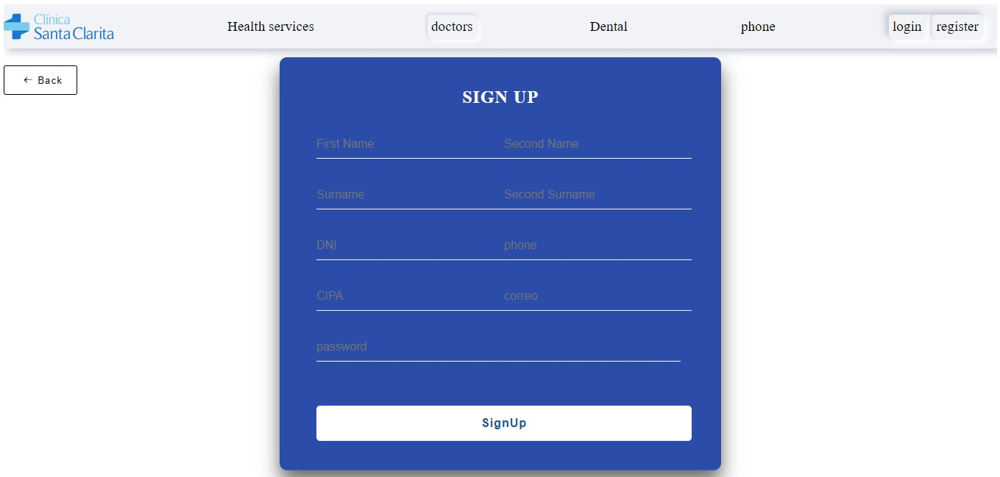
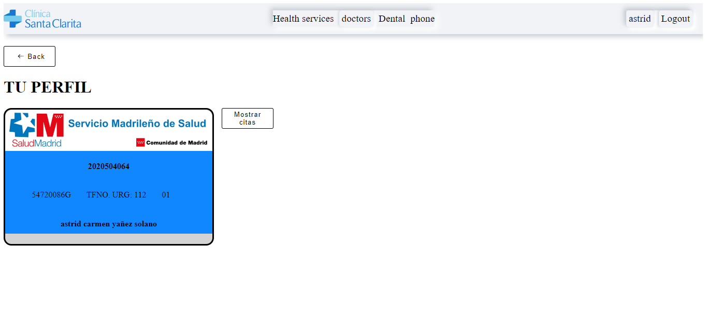
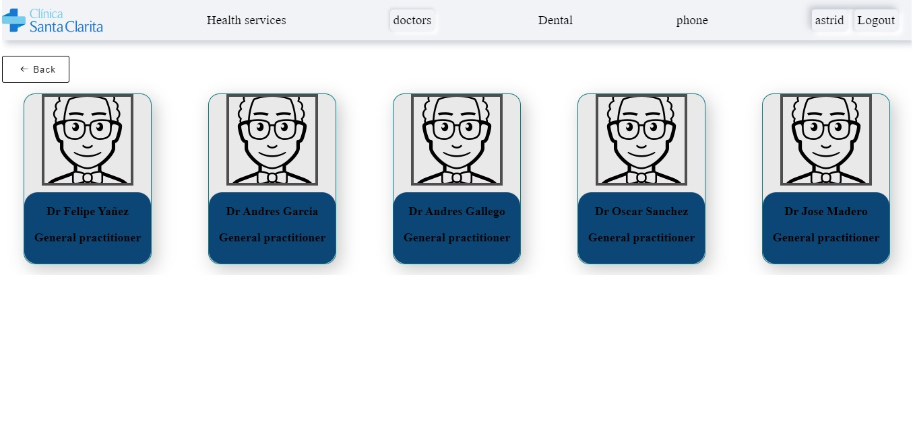
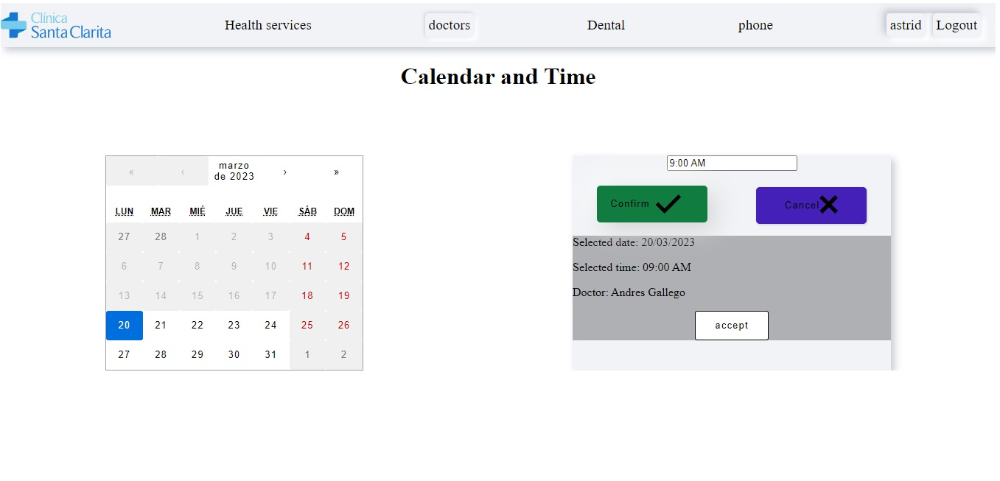
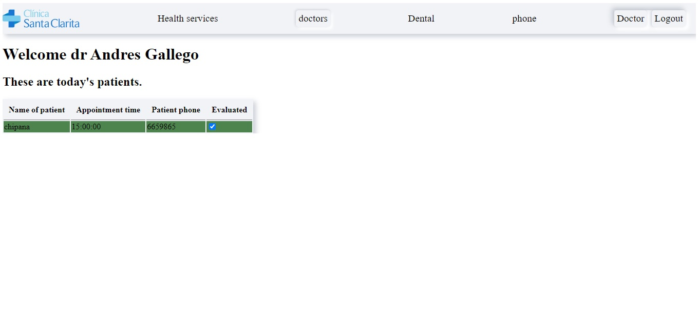

# Proyecto final Centro de salud Backend
***

Este proyecto es una aplicación web construida en ReactJS para un centro de salud, que permite a los usuarios registrarse, iniciar sesión y solicitar citas médicas con el médico de su elección. Con esta aplicación, los usuarios pueden seleccionar el médico disponible en el horario que mejor se adapte a sus necesidades y cancelar las citas programadas. La aplicación cuenta con una interfaz de usuario amigable y responsiva, así como una sólida arquitectura de backend, que garantiza la seguridad y la privacidad de la información de los usuarios.

## Tecnologias utilizadas 🦾

* ReactJS: La biblioteca de JavaScript que has utilizado para crear la interfaz de usuario.
* CSS: El lenguaje de estilo que has utilizado para dar estilo a tu proyecto.
* React Router: Una biblioteca de enrutamiento que has utilizado para manejar las rutas de tu aplicación.
* Axios: Una biblioteca de JavaScript que has utilizado para realizar solicitudes HTTP.
* Redux: Una biblioteca de gestión de estado que has utilizado para mantener el estado de la aplicación.
* React Calendar: Una biblioteca de componentes de React utilizada para proporcionar funcionalidad de calendario en la interfaz de usuario.
* React Datetime: Una biblioteca de componentes de React utilizada para proporcionar funcionalidad de selección de fechas y horas en la interfaz de usuario.

## Instrucciones de instalacion 📋

1. Clonar el repositorio: Primero, deberás clonar el repositorio del proyecto.
2. Instalar dependencias: Luego, debes abrir una terminal en la carpeta del proyecto y ejecutar el comando npm install. Esto instalará todas las dependencias necesarias para el proyecto.
3. Configurar la base de datos: Se debe configurar antes de ejecutar la aplicación. Para esto, se proporciona los detalles de conexión en un archivo .env.
4. Ejecutar la aplicación: Una vez que se han instalado las dependencias y se ha configurado la base de datos, puedes ejecutar la aplicación utilizando el comando npm start. Esto iniciará el servidor y abrirá la aplicación en tu navegador predeterminado.
5. Usar la aplicación: Para utilizar la aplicación, debes registrarte como usuario y luego iniciar sesión con tus credenciales. Una vez que hayas iniciado sesión, podrás solicitar citas médicas con los médicos disponibles.

## Uso del proyecto 🚀
Al inciar el proyecto estaran en la parte del Home.

### Usuarios

Para logearse debera pulsar en login o al intentar pedir cita si no esta logeado lo redirige al login 

El usuario tambien podra registarse donde se pedira cirtos datos personales.

Una vez el usuario se pueda logear entrara a un perfil donde podra ver su tarjeta de servicio de salud y las citas medicas si a solicitado alguna.

Tambien podra elegir un medico con el cual tendra una cita medica.

Una vez sepa el medico con el cual quiere la cita medica se mostrara un calendario para seleccionar la fecha y la hora y el medico no tiene una cita a esa hora, dara un ok y regresara al home, y el usuario podra ver su cita en su perfil.

### Medicos

Los medicos podran logearse igual que los usuarios. 

En su perfil podran ver las citas que tienen en el dia y dar un check a cada usuario. 

